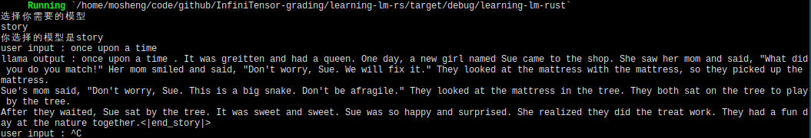
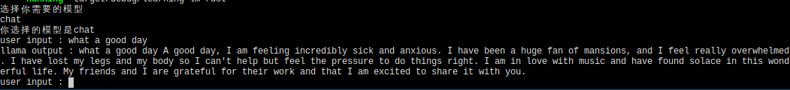

# 大模型推理系统实验报告

### 二阶段基础算子部分

`swiglu`算子，根据公式直接对Tensor内部每个元素进行处理即可。

`rms_norm`算子，根据提示，只考虑最后一维度的计算，因而不一定需要实现广播，代码中的实现也只针对最后一维度进行计算。

计算方式记录：根据最后一维度，设长度为$len$,最后维度为$n$,则对每个$\frac{len}{n}$，进行公式的操作即可。

对于`矩阵乘`算子，本次实验仅实现了二维矩阵的乘法。

`mlp`算子，直接根据计算过程调用相应的算子即可。

## 通过指标部分

### 模型推理 story 推理

* 模型加载

    模型参数存储在 safetensors 文件中，加载时通过 get_tensor 解析二进制数据，并转换为 32 位浮点张量，逐步构建模型结构。tie_word_embeddings 配置决定了词嵌入表的来源（chat 模型需要单独处理）。最终，所有组件整合完成模型初始化。


* 实现 Self-Attention

    self-attention 计算过程中，查询向量与键向量的点积得分经过缩放，并通过 Softmax 归一化。随后，使用注意力权重加权求和值向量，并将结果写入隐藏状态张量。该过程采用多级并行优化策略（KV 头分组、序列分块、向量化展开），提高计算效率，同时支持分组查询注意力机制，以减少计算量。

* 完成story功能

    在 self-attention 机制实现后，完善 model.rs 文件中的 generate 函数，即可完成 story 生成。模型通过 forward 函数推理，每次输出一个 token，最终对 token 进行解码，得到完整的文本内容。

story完成结果如下:



### AI 对话部分 chat对话 

相比 story 生成，chat 模型需额外维护对话上下文，并插入角色标识，以确保对话逻辑清晰连贯。核心推理流程保持一致，仅在主函数中加入 chat 模式切换，以便灵活使用。


chat部分结果如下:


## 拓展功能 (非评优部分)

当前程序支持 story 和 chat 两种模式，用户可在运行时选择所需的模型。交互流程如下：

1. 启动程序后，用户会看到提示：
```bash
选择你需要的模型
```
2. 用户输入 story 或 chat，系统将加载相应的模型：
```bash
你选择的模型是 story
```
或
```bash
你选择的模型是 chat
```
3. 如果输入无效，程序返回提示并退出：
```bash
your input is unsupported <用户输入>
```